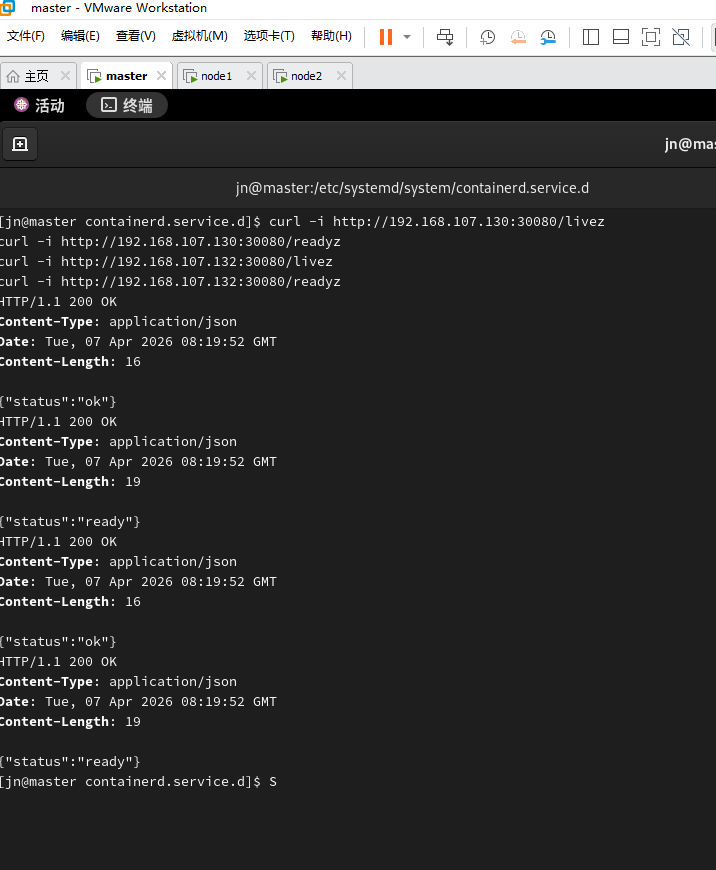
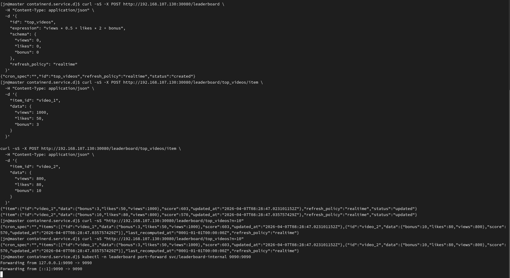

# 高性能热点榜单微服务

基于 Go 与 Redis 构建的高性能排行榜微服务，面向分布式系统中的热点数据计算、存储与查询场景设计。服务支持动态评分表达式、实时榜与定时榜两种刷新模式，并通过缓存存储、批量重算、并发保护、分布式锁与分层调度等多种机制，提升高并发场景下的处理效率、数据一致性与服务稳定性，并具备健康检查、指标暴露、容器化部署及 Kubernetes 集成等基础工程能力。

## 功能概览

- 创建排行榜
- 写入或更新条目
- 查询 Top N
- 手动触发重算
- 在线更新定时表达式
- 在线更新评分表达式
- 删除排行榜
- 删除单个条目
- 健康检查接口
- Prometheus 指标暴露
- 容器化与 Kubernetes 清单


## 效果速览（k8s部署下）


环境为1 master，2 node节点集群部署，可得到各接口正常。



## 刷新模式

### `realtime`

写入条目时立即计算分数，并同步更新排行榜结果。

适合：

- 排名结果需要尽量实时
- 表达式复杂度适中
- 写入量在服务可承受范围内

### `scheduled`

写入条目时仅保存原始数据并标记为 dirty，后续由内置调度器或手动接口批量重算。

适合：

- 写入频率较高
- 评分表达式较复杂
- 可以接受按批次刷新结果

## 项目结构

```text
.
├── main.go
├── Dockerfile
├── k8s/
│   ├── namespace.yaml
│   ├── configmap.yaml
│   ├── secret.yaml
│   ├── service.yaml
│   ├── deployment.yaml
│   └── kustomization.yaml
├── cmd/
│   ├── loadtest/
│   ├── loadtest_cron/
│   ├── loadtest_d/
│   └── loadtest_e/
└── internal/
    ├── app/
    │   └── app.go
    ├── api/
    │   ├── health.go
    │   ├── leaderboard_handlers.go
    │   ├── metrics.go
    │   ├── requests.go
    │   ├── response.go
    │   ├── router.go
    │   └── system_handlers.go
    ├── config/
    │   └── config.go
    └── core/
        ├── leaderboard.go
        ├── metrics.go
        ├── redis_repo.go
        ├── repository.go
        ├── runtime_config.go
        ├── tick.go
        ├── timeouts.go
        └── *_test.go
```

当前结构分层重点：

- `internal/app`：应用装配、Redis 初始化、HTTP Server 生命周期管理
- `internal/api`：路由、HTTP Handler、健康检查、HTTP 指标
- `internal/config`：环境变量配置加载
- `internal/core`：排行榜核心逻辑、Redis 仓储、调度器、核心指标

## 运行要求

- Go `1.25+`
- Redis `6+`

## 环境变量

### 服务监听

- `BUSINESS_ADDR`
  默认值：`:8080`
- `INTERNAL_ADDR`
  默认值：`:9090`

### Redis

- `REDIS_ADDR`
  默认值：`localhost:6379`
- `REDIS_PASSWORD`
  默认值：空
- `REDIS_DB`
  默认值：`0`
- `REDIS_DIAL_TIMEOUT`
  默认值：`1s`
- `REDIS_READ_TIMEOUT`
  默认值：`1s`
- `REDIS_WRITE_TIMEOUT`
  默认值：`1s`
- `REDIS_POOL_TIMEOUT`
  默认值：`2s`
- `REDIS_REPOSITORY_TIMEOUT`
  默认值：`800ms`

### HTTP 与生命周期

- `HTTP_READ_HEADER_TIMEOUT`
  默认值：`2s`
- `HTTP_READ_TIMEOUT`
  默认值：`5s`
- `HTTP_WRITE_TIMEOUT`
  默认值：`10s`
- `HTTP_IDLE_TIMEOUT`
  默认值：`60s`
- `SHUTDOWN_TIMEOUT`
  默认值：`5s`
- `HEALTHCHECK_TIMEOUT`
  默认值：`1s`

### 调度与锁

- `SCHEDULER_ENABLED`
  默认值：`true`
- `SCHEDULED_TASK_TIMEOUT`
  默认值：`5s`
- `SCHEDULED_TASK_LOCK_TTL`
  默认值：`10s`
- `LEADERBOARD_CREATE_LOCK_TTL`
  默认值：`5s`

## 本地启动

```powershell
go run .
```

默认端口：

- `:8080` 业务接口
- `:9090` 内部接口

## 健康检查

业务端口与内部端口均提供以下接口：

- `GET /livez`
  存活检查
- `GET /readyz`
  就绪检查，会检查 Redis 连通性
- `GET /healthz`
  综合健康检查，会检查 Redis 连通性

## 端口职责

### 业务端口 `8080`

主要承载业务 API：

- 创建排行榜
- 写入条目
- 查询排行榜
- 更新定时策略
- 更新评分表达式
- 手动重算
- 删除条目
- 删除排行榜

### 内部端口 `9090`

主要承载内部接口：

- `GET /metrics`
- `POST /system/cron/tick`
- 健康检查接口

## HTTP API

### 1. 创建排行榜

`POST /leaderboard`

请求示例：

```json
{
  "id": "top_videos",
  "expression": "views * 0.5 + likes * 2 + bonus",
  "schema": {
    "views": 0,
    "likes": 0,
    "bonus": 0
  },
  "refresh_policy": "realtime"
}
```

定时榜示例：

```json
{
  "id": "hot_articles",
  "expression": "views * 0.2 + likes * 5 + shares * 8",
  "schema": {
    "views": 0,
    "likes": 0,
    "shares": 0
  },
  "refresh_policy": "scheduled",
  "cron_spec": "@every 10s"
}
```

说明：

- 同名排行榜重复创建会返回冲突
- `scheduled` 模式下会校验 `cron_spec`

### 2. 写入或更新条目

`POST /leaderboard/{id}/item`

请求示例：

```json
{
  "item_id": "video_123",
  "data": {
    "views": 1000,
    "likes": 50,
    "bonus": 3
  }
}
```

行为：

- `realtime` 模式下立即计算并写入分数
- `scheduled` 模式下保存原始数据并标记 dirty

### 3. 查询排行榜

`GET /leaderboard/{id}?n=10`

说明：

- 默认返回前 `10` 条
- Redis 读取失败时会返回错误，而不是静默返回空榜

### 4. 手动触发重算

`POST /leaderboard/{id}/recompute`

说明：

- 处理 dirty 条目并更新排行榜结果
- 如果同一排行榜已有重算任务执行中，会返回冲突

### 5. 更新定时策略

`POST /leaderboard/{id}/schedule`

请求示例：

```json
{
  "cron_spec": "@every 30s"
}
```

说明：

- 会把排行榜切换为 `scheduled`
- 会重新注册调度分层

### 6. 在线更新评分表达式

`POST /leaderboard/{id}/expression`

请求示例：

```json
{
  "expression": "views * 0.3 + likes * 4 + shares * 10",
  "schema": {
    "views": 0,
    "likes": 0,
    "shares": 0
  }
}
```

说明：

- `expression` 必填
- `schema` 可选
- 如果提供 `schema`，会替换原有 schema
- 更新成功后会执行一次全量重算

### 7. 删除条目

`DELETE /leaderboard/{id}/item/{item_id}`

说明：

- 删除原始条目数据
- 删除对应分数
- 删除 dirty 标记

### 8. 删除排行榜

`DELETE /leaderboard/{id}`

说明：

- 删除元数据、原始条目、分数集合、dirty 集合
- 清理调度分层索引
- 清理当前进程内缓存对象

### 9. 手动触发全部调度层

`POST /system/cron/tick`

说明：

- 该接口仅挂在内部端口
- 适合内部运维触发、联调和调度补偿


## 核心实现说明

### 表达式执行

评分表达式基于 `github.com/expr-lang/expr` 编译执行。

当前处理方式：

- 创建排行榜时编译表达式
- 更新表达式时重新编译
- 运行时环境基于 `schema` 和条目数据生成
- 支持 `updated_at` 和 `now`

### 并发与一致性

当前实现包含以下处理：

- 排行榜恢复使用 `singleflight`
- 排行榜运行时状态增加互斥保护
- 定时重算与手动重算使用 Redis 锁避免重复执行
- 创建排行榜增加创建锁，减少重复创建覆盖风险
- 批量重算发生部分失败时返回错误，不再伪装为成功
- dirty 条目通过 `SSCAN` 分批扫描
- 脏条目缺失或损坏时会在重算过程中清理

### 调度器

服务内置轻量分层调度器，当前层级包括：

- `5s`
- `1m`
- `30m`
- `6h`

执行逻辑：

1. 从对应分层集合读取候选排行榜
2. 结合 `cron_spec` 和 `last_recomputed_at` 判断是否到期
3. 获取 Redis 锁避免重复重算
4. 在受控超时内执行重算

## 可观测性

### 已提供

- 健康检查接口
- Prometheus `/metrics`
- HTTP 请求总量与延迟指标
- 排行榜创建、恢复、写入、重算、表达式更新、删除、调度 tick 等核心指标
- JSON 结构化日志

### 当前指标示例

- `http_requests_total`
- `http_request_duration_seconds`
- `leaderboard_create_total`
- `leaderboard_restore_total`
- `leaderboard_upsert_total`
- `leaderboard_recompute_total`
- `leaderboard_recompute_duration_seconds`
- `leaderboard_expression_update_total`
- `leaderboard_expression_update_duration_seconds`
- `leaderboard_scheduler_tick_total`
- `leaderboards_loaded`

## Docker

### 构建镜像

```
docker build -t leaderboard-service:latest .
```

### 启动容器

```
docker run --rm -p 8080:8080 -p 9090:9090 `
  -e REDIS_ADDR=host.docker.internal:6379 `
  leaderboard-service:latest
```

## Kubernetes

`k8s/` 目录提供了基础部署资源：

- `Namespace`
- `ConfigMap`
- `Secret`
- `Service`
- `Deployment`
- `Kustomization`

其中：

- `leaderboard-service` 暴露业务端口 `8080`
- `leaderboard-internal` 暴露内部端口 `9090`
- Pod 上带有 Prometheus 抓取注解
- 使用 readiness/liveness/startup probe

### 部署

```powershell
kubectl apply -k k8s/
```

### 查看服务

```powershell
kubectl -n leaderboard get deploy,svc,pod
```

## 测试

### 运行全部测试

```powershell
go test ./...
```

如果在 Windows 下默认 Go 缓存目录不可写，可以使用工作区缓存：

```powershell
$env:GOCACHE="$PWD\\.gocache"
$env:GOTMPDIR="$PWD\\.gotmp"
go test ./...
```

### 综合 Redis 终极测试

`internal/core/ultimate_redis_test.go` 使用真实 Redis 做一条较完整的集成链路验证，覆盖：

- 实时榜
- 定时榜
- 非法 `cron_spec`
- 重复创建冲突
- 在线更新表达式
- 条目删除
- 排行榜删除
- 大批量数据写入与重算
- 并发重算冲突处理


## 压测辅助程序

项目内置了几组辅助程序，可用于本地联调和简单压测：

- `go run ./cmd/loadtest`
- `go run ./cmd/loadtest_cron`
- `go run ./cmd/loadtest_d`
- `go run ./cmd/loadtest_e`

